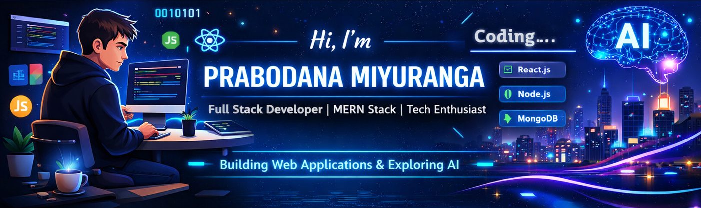

  

<h1 align="center">Hi 👋, I'm Prabodana Miyuranga</h1>

Full Stack Developer | MERN Stack Developer | React Enthusiast

---

## 💫 About Me

- 🎓 **Undergraduate** in Computer Science based in **Kegalle, Sri Lanka** 🇱🇰  
- 💡 Passionate about building scalable **Web Applications** and exploring **AI**.  
- 🌱 Currently mastering: `<Machine Learning />`, `<Next.js />`, and `SpringBoot`.  
- 💬 Ask me about: **Python**, or full-stack development (MERN).  
- ✉️ Reach me at: **miyuranga.dev@gmail.com**

---

## 🛠️ Tech Stack & Tools

### 🌐 Languages & Frameworks

#### Frontend Development

#### Backend & Database

#### Mobile, AI & Data Science

#### MERN Stack Specialization

#### Design & Workflow

---

## 📊 GitHub Stats

---

## 🌐 Let's Connect

---

## ⚡ Fun Fact

> "The best way to predict the future is to create it."

When I'm not coding, you can find me exploring new UI trends, building side projects, and improving my development skills.

---
